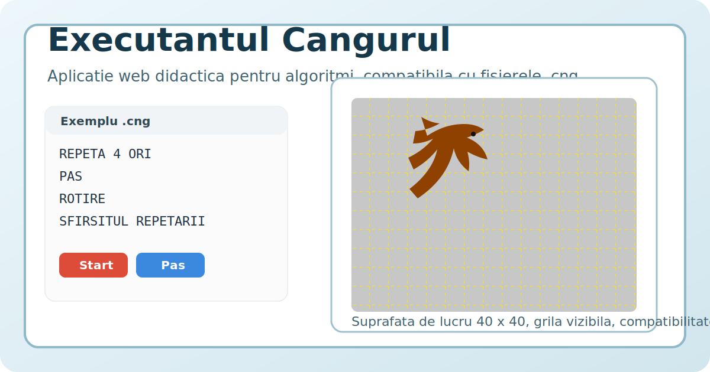

# Executantul Cangurul

Versiune web modernizata a aplicatiei didactice "Executantul Cangurul", adaptata pentru dispozitive moderne si compatibila cu programele istorice `.cng`.



## Autor

Carchilan Lilia, profesor de informatica, grad didactic I, master in stiinte ale educatiei.

## Prezentare

Aplicatia pastreaza spiritul versiunii clasice a executantului Cangurul si il aduce in browser, intr-o forma care poate fi folosita pe desktop, tableta si telefon.

Proiectul permite:

- rularea in browser
- incarcarea fisierelor istorice `.cng`
- folosirea unei suprafete de lucru de `40 x 40` patratele
- publicarea online prin GitHub Pages
- instalarea ca aplicatie web pe telefon prin PWA

## Imagine de prezentare

Repository-ul include deja o imagine de prezentare in:

- `docs/cover.svg`

Poti inlocui ulterior aceasta imagine cu o captura reala a aplicatiei, de exemplu:

- `docs/screenshot.png`

## Structura proiectului

- `index.html` - punctul principal de pornire
- `drawer_free.html` - varianta libera
- `Ex_Cangur/` - exemple `.cng` incluse in proiect
- `js/cng_parser.js` - parser pentru fisierele `.cng`
- `js/drawer.js` - motorul principal de desen si executie
- `js/drawer_free.js` - configuratia modului liber
- `robot.css` - stilurile interfetei
- `manifest.webmanifest` - configuratia PWA
- `sw.js` - service worker
- `REVIVAL_PLAN.md` - planul de dezvoltare

## Pornire rapida

### 1. Rulare locala

Varianta simpla:

- deschide `index.html` in browser

Varianta recomandata:

```powershell
cd "D:\Documente 2025_2026\Informatica 2025-2026\Clasa 8 informatica\Algoritmi și executanți\Executantul Cangurul"
py -m http.server 8000
```

Apoi deschide:

`http://localhost:8000/index.html`

### 2. Incarcarea exemplelor

1. Deschide aplicatia in browser.
2. Apasa pe iconita de deschidere.
3. Alege un fisier din folderul `Ex_Cangur`.
4. Apasa `Start` sau `Pas`.

## Exemple incluse

Folderul `Ex_Cangur` contine exemple gata de folosit, printre care:

- `Spirala(Rom).cng`
- `Dreptunghiuri.cng`
- `Litera_L.cng`
- `PatratcuPatrat.cng`
- `romb.cng`
- `scara.cng`

## Publicare pe GitHub

Din folderul proiectului:

```powershell
git init
git add .
git commit -m "Versiune web reanimata pentru Executantul Cangurul"
git branch -M main
git remote add origin https://github.com/UTILIZATORUL_TAU/executantul-cangurul.git
git push -u origin main
```

## Publicare cu GitHub Pages

1. Intra in repository pe GitHub.
2. Deschide `Settings`.
3. Intra la `Pages`.
4. La `Build and deployment`, alege `Deploy from a branch`.
5. Selecteaza branch `main`.
6. Selecteaza folderul `/ (root)`.
7. Salveaza.

Linkul public va avea de obicei forma:

`https://UTILIZATORUL_TAU.github.io/executantul-cangurul/`

Pagina principala:

`https://UTILIZATORUL_TAU.github.io/executantul-cangurul/index.html`

## Instalare pe telefon

Dupa publicare prin GitHub Pages sau rulare prin `localhost`, aplicatia poate fi instalata ca PWA.

In general:

- pe Android: `Add to Home Screen` sau `Install app`
- pe iPhone/iPad: `Share` -> `Add to Home Screen`

## Licenta

Proiectul foloseste licenta MIT.

Detalii in:

- `LICENSE`

## Observatii

- Fisierele `.cng` sunt compatibile printr-un strat de conversie in JavaScript.
- Proiectul este o baza moderna pentru reanimarea aplicatiei clasice.
- Poate fi extins ulterior cu lectii, mod profesor, biblioteca de exercitii si suport offline mai avansat.
